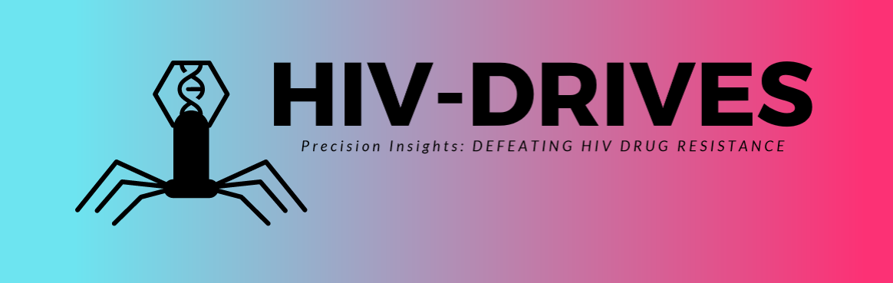
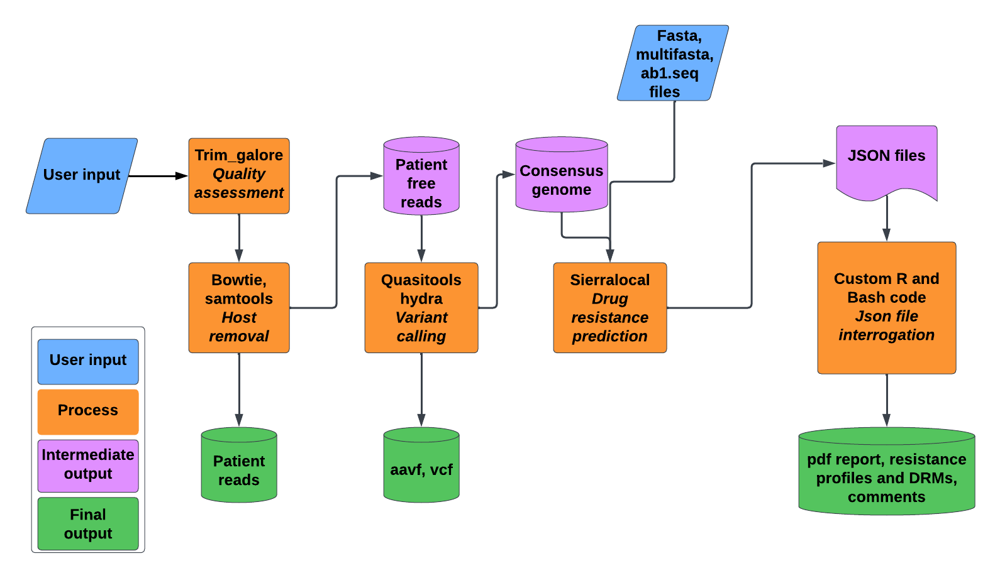

<p align="middle">`

</p>

## 🎬 HIV-DRIVES: HIV Drug Resistance Identification, Variant Evaluation, & Surveillance

HIV-DRIVES is a pipeline designed to perform HIV Drug resistance profiling, Variant Evaluation, and Surveillance while giving an easy to read pdf report besides the other output files. HIV-DRIVES supports Illumina data in paired and single ended fastq format, sanger data in ab1.seq format, and both fasta and multiple fasta files. Given illumina data, HIV-DRIVES additionally separates the patient's reads from the viral reads before it proceeds with the downstream processes. Therefore, this facilitates sharing of viral reads while protecting the patient's privacy. HIV-DRIVES is supported by both sierra-local and quasitools in the background.



## 🏆 Motivation

The global prevalence of resistance to the Human Immunodeficiency Virus (HIV) antiretroviral therapy (ART) drugs emphasizes the need to fast-track the transition to the newer regimens such as dolutegravir-based combinations. In order to slow down or halt HIV drug resistance (HIVDR), all stakeholders need to promote the availability of optimal medicines to treat HIV infections, support retention in care and optimal adherence to treatment, and increase access and use of viral load testing to know if HIV treatment is working, and rapidly switch regimens in cases of confirmed treatment failure and lastly, use of next-generation sequencing (NGS) for HIVDR profiling to guide treatment.  Africa also accounts for nearly two thirds of the global total of new HIV infections and remains the most affected region, with at least 25.7 million people living with HIV in 2018. COVID-19 catapulted routine NGS in many national public health laboratories in Africa and is poised to support genomic activities in different disease programs including HIV. A number of countries embracing performing NGS-HIVDR are facing the challenge of bioinformatics analysis and interpretation of the data for patient management. We present HIV-DRIVES (HIV Drug Resistance Identification, Variant Evaluation, and Surveillance), an NGS-HIVDR bioinformatics pipeline that has been developed and validated using Illumina short-reads, sanger ab1.seq files, and fasta files to HIVDR testing and interpretation.

## 🏷️ Pipeline features

HIV-DRIVES is able to perform:
1. Poor read trimming using trim_galore
2. Variant calling and consensus genome generation
3. Host Decontamination: The program removes host reads and produces host free fastq files. This is motivated by the issue of patient privacy
4. Consensus generation: The program uses hydra within the quasitools to generate a consensus sequence
5. Variant calling: The program uses hydra within the quasitools to detect variants within the query HIV genomes
6. Resistance profiling and mutation detection: This is performed by sierra-local. Sierra-local output is interrogated to give an easy to understand pdf report

Note: Besides, the pdf report, the pipeline produces aavf, vcf, drms20.csv with DRMS above 20 percent prevalence for each gene detected, res.csv with the resistance profiles. This is done for each sample
 
## ⚙️ Installation

Make sure you have [Miniconda](https://conda.io/miniconda.html) or [Anaconda](https://docs.anaconda.com/free/anaconda/install/linux/) on your Linux system using the links provided
Clone the software from the offical repository using: 

`conda activate base`

`cd && git clone https://github.com/MicroBioGenoHub/HIV-DRIVES.git`

Select the installer for your computer and execute it by running: 

`cd HIV-DRIVES`

`conda env create -n HIV-DRIVES --file HIV-DRIVES-1.0-Linux-Installer.yml`

`bash setup.sh`

`cd && bash clean.sh` 

`rm -rf clean.sh`

Run the program to make sure you have access to all the plug-ins using the command `HIV-DRIVES -h` to view output below:

```bash
This is HIV-DRIVES 1.0
Developed and maintained by Stephen Kanyerezi, Ivan Sserwadda & Gerald Mboowa

Synopsis:
HIV-DRIVES enables one to do HIV Drug Resistance Identification, Variant Evaluation, and Surveillance

Usage:
Given paired reads, to run the whole pipeline; HIV-DRIVES [options] -f <path of forward read> -r <path of reverse read> -o <output directory to be created> --all true
Given paired reads, to perform variant calling and generate a consensus genome; HIV-DRIVES [options] -r <path of reverse read> -o <output directory to be created> --varcall true
Given single ended reads, to run the whole pipeline; HIV-DRIVES [options] -o <output directory to be created> --single-end true --se <path of single ended read> --all true
Given single ended reads, to perform variant calling and generate a consensus genome; HIV-DRIVES [options] -o <output directory to be created> --single-end true --se <path of single ended read> --varcall true

General:
-h/--help       Show this help menu
-v/--version    Print version and exit
-x/--citation   Show citation and exit

Mandatory options for paired reads:
-f/--forward-read Path of the forward reads [either .fastq or .fastq.gz]

-r/--reverse-read Path of the reverse reads [either .fastq or .fastq.gz]

-s/--single-end [true or false (default)] Set to true if single ended reads

--se                Path of single end read. Applicable if --single-end set to true

--consensus Path of fasta file from which to perform resistance profiling as well as variants detection. Applicable if you only have consensus genomes

-o/--output-dir        Directory to be created for results

--all                [true or false (default)] Run the whole pipeline to generate variants, consensus genome, and resistance profiles. Applicable if --varcall not set to true

--varcall        [true or false (default)] Genrate variants and consensus genome. Applicable if --all not set to true

--resistance [true or false (default)] Perform resistance profiling as well as variants detection. Applicable only with --consensus option and if --varcall and --all not set to true

Other options:
--xml Path of HIV algorithm xml file to be used

--alignment [post or nuc (default)] amino acid aligner to be used. Either postalign or nucamino

--json Path of APOEBEC mutations file

--update [true or false (default)] update the HIV algorithm and APOEBEC mutations

--cores Number of cpus to use. Default=4
                     
For further explanation please visit: https://github.com/MicroBioGenoHub/HIV-DRIVES

```

## How to run currently

If you have paired ended reads and you want to run the full pipeline, use the command below

```
HIV-DRIVES -o <output_dir> -f <forward read path> -r <reverse read path> --all true
```
For more user case scenarios, refer to [case scenarios](cases.md)

## 📝 Information

### How to cite

When using HIV-DRIVES, please cite as:   

https://github.com/MicroBioGenoHub/HIV-DRIVES.git. The publication for this pipeline can be accessed via [https://www.microbiologyresearch.org/content/journal/acmi/10.1099/acmi.0.000815.v3].

### 🎞️ Credits

This pipeline was written by a collaborative effort between Stephen Kanyerezi [Kanyerezi30](https://github.com/Kanyerezi30), Ivan Sserwadda [GunzIvan28](https://github.com/GunzIvan28) and Gerald Mboowa [gmboowa](https://github.com/gmboowa). If you want to contribute, please open an issue or a pull request and ask to be added to the project - everyone is welcome to contribute.

### ✍️ Authors

- [Stephen Kanyerezi](https://github.com/Kanyerezi30)
- [Ivan Sserwadda](https://github.com/GunzIvan28)
- [Gerald Mboowa](https://github.com/gmboowa)

### 🙏 Acknowledgements
We would like to express our heartfelt gratitude to the developers of Sierra-local and Quasitools for their invaluable contributions to the development of HIV-DRIVES. Their exceptional tools have played a pivotal role in enhancing the functionality and efficiency of our work, and we are sincerely thankful for their dedication and expertise.

### 🔌 Third Party Plugins

This softwares' foundation is built using pre-existing tools. When using it, please don't forget to cite the following:
- [Bowtie2](https://github.com/BenLangmead/bowtie2)
- [Minimap2=2.1](https://github.com/lh3/minimap2)
- [Pip](https://pypi.org/project/pip/)
- [r-base=4.1.1](https://www.r-project.org/)
  + [r-rmarkdown=2.14](https://cran.r-project.org/web/packages/rmarkdown/index.html)
  + [r-jsonlite=1.8.0](https://cran.r-project.org/web/packages/jsonlite/index.html)
  + [r-knitr=1.39](https://cran.r-project.org/web/packages/knitr/index.html)
  + [r-dplyr=1.0.9](https://cran.r-project.org/web/packages/dplyr/index.html)
  + [r-kableextra](https://cran.r-project.org/web/packages/kableExtra/index.html)
  + [r-tidyr=1.2.0](https://cran.r-project.org/web/packages/tidyr/index.html)
- [Quasitools=0.7.0](https://github.com/phac-nml/quasitools)
- [Samtools](https://github.com/samtools/samtools)
- [Sierralocal](https://github.com/PoonLab/sierra-local)
- [Trim-galore=0.6.10](https://github.com/FelixKrueger/TrimGalore)

### 🐛 To report bugs, ask questions or seek help

The software developing team works round the clock to ensure the bugs within the program are captured and fixed.
For support or any inquiry:
You can submit your query using the [issue tracker](https://github.com/MicroBioGenoHub/HIV-DRIVES/issues)

<p align="middle">`

</p>

Note: Current tests are on Ubuntu 18.04.6 LTS using paired end reads from the illumina platform
